# PodIntel — Technical Design & Architecture (MVP)

Companion to [SPEC.md](./SPEC.md). This covers system architecture, data flow, and the design decisions/trade-offs behind them, organized by module rather than as one combined diagram.

## 1. Module Map

The system is six modules in a pipeline, plus a web app that reads from the last three:

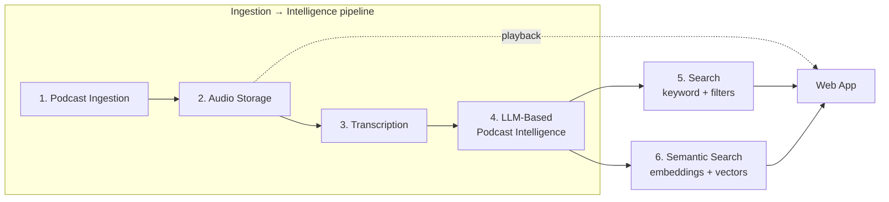

| # | Module | Responsibility | Owns |
|---|---|---|---|
| 1 | Podcast Ingestion | Discover podcasts/episodes from curated RSS feeds, dedupe | `podcasts`, `episodes` (metadata) |
| 2 | Audio Storage | Download audio, store durably, serve it back without proxying | `episodes.storage_key`, object storage |
| 3 | Transcription | Audio → timestamped text | `transcripts` |
| 4 | LLM-Based Podcast Intelligence | Transcript → summary/topics/keywords, keyword-search index | `episode_intelligence`, `topics`, `episode_topics`, `episodes.search_vector` |
| 5 | Search | Keyword + metadata filtering over module 4's output | reads `episodes.search_vector` |
| 6 | Semantic Search | Episode/segment embeddings, vector search, hybrid ranking on top of module 5 | Qdrant `episode_vectors`, `segment_vectors` |

Modules 1–4 are connected by Kafka (§2) — each is a separate consumer process and can be deployed, scaled, and reasoned about independently. Modules 5 and 6 are both read paths off the same web request (`GET /search`); 6 is additive to 5, not a replacement for it (§8).

## 2. Shared Pipeline Backbone: Kafka & Episode Status

Modules 1–4 (and module 6's write side) hand off work via Kafka — one topic per stage transition, keyed by `episode_id` so per-episode ordering holds across retries and consumer rebalances. This section covers the mechanism once; each module below just says which topic it consumes/produces.

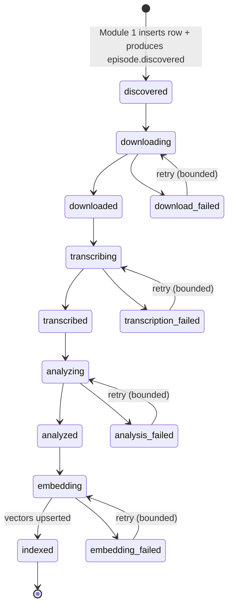

| Topic | Producer (module) | Consumer group (module) | Payload |
|---|---|---|---|
| `episode.discovered` | feed-poller (1) | downloader (2) | `{episode_id, source_audio_url}` |
| `episode.downloaded` | downloader (2) | transcriber (3) | `{episode_id, storage_key}` |
| `episode.transcribed` | transcriber (3) | analyzer (4) | `{episode_id}` |
| `episode.analyzed` | analyzer (4) | embedder (6) | `{episode_id}` |
| `episode.indexed` | embedder (6) | *(reserved for future consumers)* | `{episode_id}` |
| `pipeline.dlq` | any stage, retries exhausted | ops tooling / manual replay | `{episode_id, stage, attempts, last_error}` |

Payloads carry ids, not blobs — Postgres/S3 stay the source of truth, Kafka stays a thin notification layer, and a consumer that's behind can always re-derive current state from the DB row rather than needing the message replayed.

**Retry pattern**: Kafka has no native delayed redelivery, so a failed stage increments an `attempt` header and re-produces to its *own* input topic after an in-process backoff (e.g. 30s/2min/8min). Once `attempts >= MAX_ATTEMPTS` (default 3), it produces to `pipeline.dlq` instead and sets `episodes.status = '{stage}_failed'`. `status`/`attempts` on the `episodes` row remain the source of truth an operator reads (`GET /admin/episodes?status=*_failed`, with a manual retry action); Kafka is what moves work forward, not what's displayed.

## 3. Module 1 — Podcast Ingestion

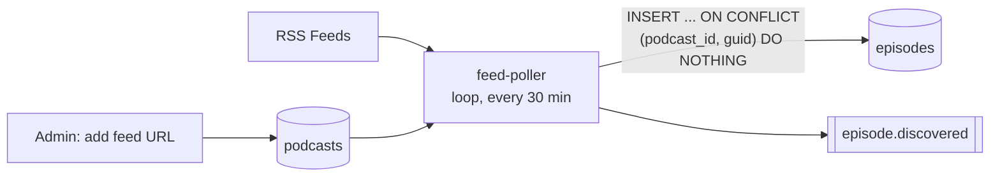

- Admin registers a podcast by RSS feed URL (`POST /admin/podcasts`).
- `feed-poller` re-fetches every active feed on an interval, parsing `<item>` entries for title, description, publish date, duration, enclosure URL, and GUID.
- `(podcast_id, guid)` is the dedup key — re-polling an unchanged feed inserts nothing and produces no Kafka messages, so a re-poll never re-triggers the rest of the pipeline for episodes it's already seen.
- `podcasts.last_polled_at` / `last_poll_status` track feed health independent of any single episode's pipeline status.

## 4. Module 2 — Audio Storage

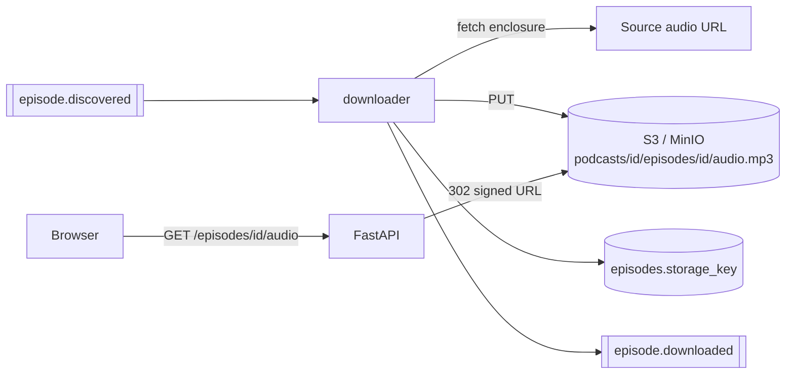

- Audio is keyed `podcasts/{podcast_id}/episodes/{episode_id}/audio.mp3` — deterministic, so a retried download is a clean overwrite, not a duplicate.
- Playback never proxies bytes through the app server: `GET /episodes/{id}/audio` issues a signed URL straight to object storage. This keeps the web app off the hot path for large file transfer.
- Failure → `status=download_failed`, follows the shared retry/DLQ pattern (§2).

## 5. Module 3 — Transcription

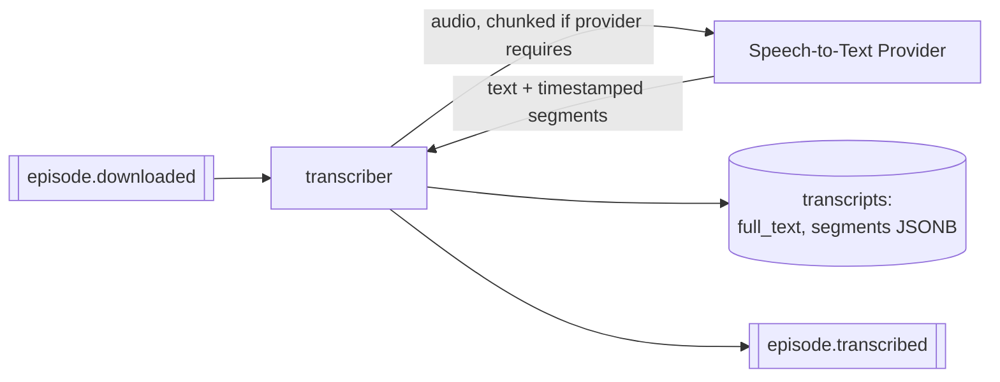

- STT provider is pluggable behind a `Transcriber` interface (e.g. Deepgram, AssemblyAI) — swappable without touching upstream/downstream modules.
- Output is full text plus timestamped segments (`start`, `end`, `text`); those segment timestamps are what module 6 later chunks for embeddings, and what let a future diarization upgrade slot in without re-transcribing.
- Failure → `status=transcription_failed`, shared retry/DLQ pattern (§2).

## 6. Module 4 — LLM-Based Podcast Intelligence

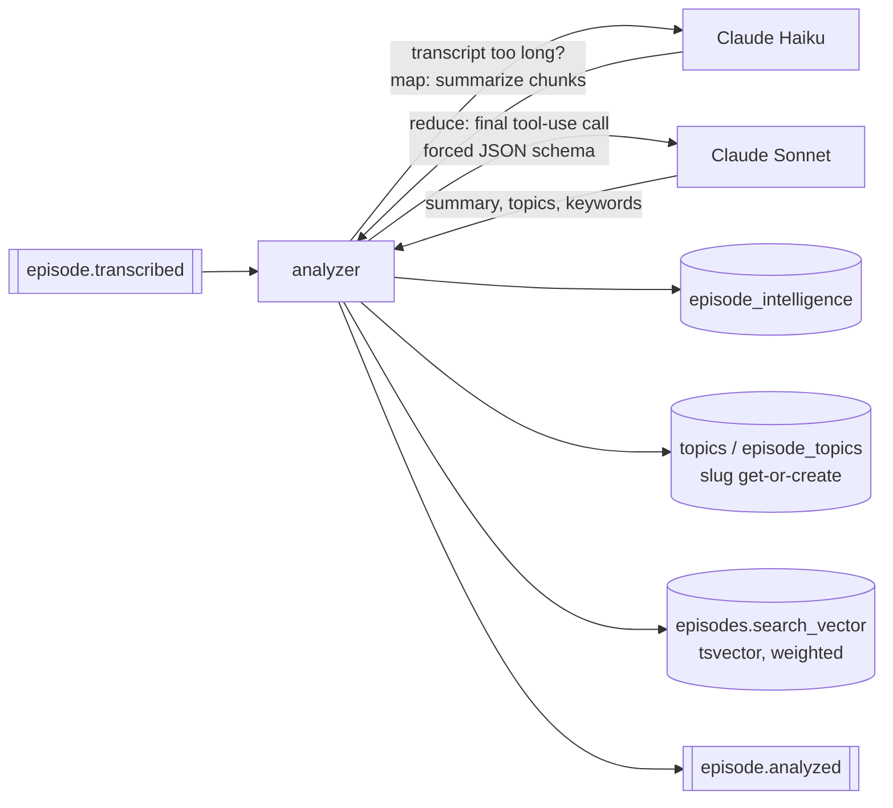

- One Claude call per episode in the common case: a single tool-use call with a forced JSON schema returns `summary`, `topics[]`, `keywords[]` together, not three separate calls.
- If the transcript exceeds the model's practical context budget, it's map-reduced first: Claude Haiku summarizes chunks (cheap), then one Claude Sonnet call synthesizes the episode-level result from those chunk summaries.
- Topics are normalized (case/whitespace-folded, slugified) and upserted into a shared `topics` table so the same topic across episodes is filterable/countable — this is what feeds module 5's topic filter and module 6's payload filters.
- `episodes.search_vector` (weighted `tsvector`: title / topics+keywords / summary / transcript text) is updated in the same step — this is module 4 producing module 5's index, not a separate job.
- `model`/`prompt_version` columns on `episode_intelligence` gate reprocessing: a prompt change never silently re-bills every episode, only ones an operator explicitly re-runs.
- Failure → `status=analysis_failed`, shared retry/DLQ pattern (§2).

## 7. Module 5 — Search (keyword + filters)

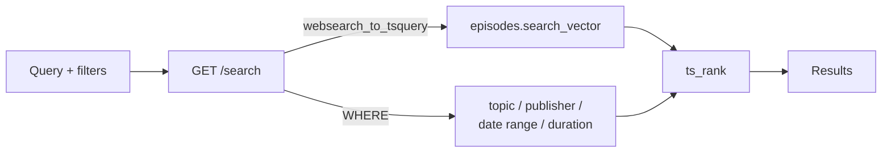

- A single Postgres query — `search_vector @@ websearch_to_tsquery(...)` ranked with `ts_rank`, combined with plain indexed `WHERE` clauses for topic/publisher/date/duration.
- This module alone satisfies the keyword/topic/publisher/date/duration search requirement with no extra infrastructure — module 6 is what adds meaning-based matching on top, not a prerequisite for basic search to work.

## 8. Module 6 — Semantic Search

Two Qdrant collections, both written only by the `embedder` consumer, populated from module 4's output:

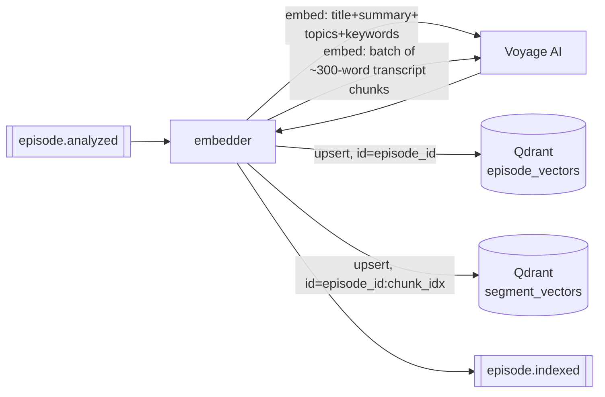

| Collection | Point id | Vector source | Payload (filtering) |
|---|---|---|---|
| `episode_vectors` | `episode_id` | `title + summary + topics + keywords` (`voyage-3`) | `podcast_id, topic_slugs[], publisher, published_at, duration_seconds` |
| `segment_vectors` | `{episode_id}:{chunk_index}` | ~250–400 word transcript chunk (`voyage-3`) | `episode_id, start, end` |

`episode_vectors` answers "which episodes are about this?"; `segment_vectors` answers "which part of this episode?" — the second collection is what lets a result show *"Relevant segment: 21:32–29:45"* without full LLM-based topic segmentation (a separate, heavier Phase 2 feature). Both are upserts keyed deterministically, so retries and deliberate re-embeds are clean overwrites. Voyage is used here exclusively for vectorization; Claude (module 4) is never asked to embed — it has no embeddings endpoint.

**Query-time: this module extends module 5's search, it doesn't replace it.**

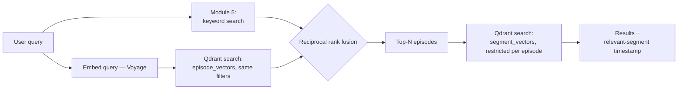

Both paths run **in parallel, always** — not query-classified into "use keyword vs. semantic." Results merge via reciprocal rank fusion (`score = Σ 1/(k + rank_i)`, `k=60`) rather than a learned re-ranker: no training data needed, and it avoids normalizing across two very different score scales (`ts_rank` vs. cosine similarity). The segment lookup only runs for the top-N already-ranked episodes, bounding it to a handful of point-lookups per request instead of scanning `segment_vectors` broadly. Topic/publisher/date/duration filters apply identically on both paths (Postgres `WHERE` / Qdrant payload filter), so filtered results stay consistent between the two.

## 9. Data Model (full reference)

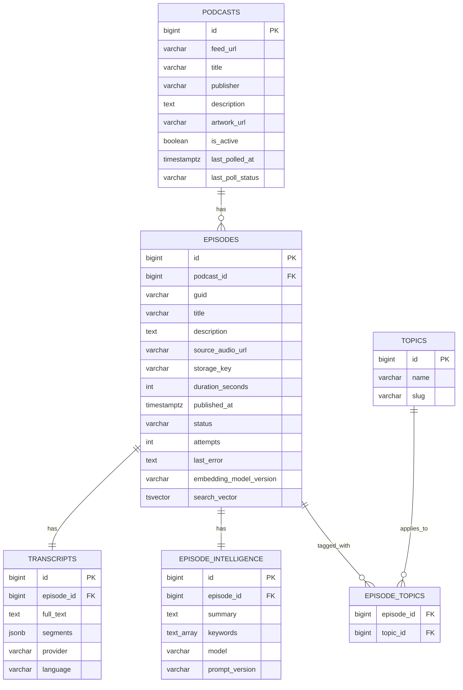

| Table / collection | Owned (written) by | Read by |
|---|---|---|
| `podcasts` | Module 1 | Module 1 (admin/ops), web app |
| `episodes` (metadata, `status`) | Module 1 (insert); `status`/`attempts` updated by whichever module is active | All modules, web app |
| `episodes.storage_key` | Module 2 | Module 2 (playback URL) |
| `episodes.search_vector` | Module 4 | Module 5 |
| `episodes.embedding_model_version` | Module 6 | Module 6 (re-embed gate) |
| `transcripts` | Module 3 | Module 4, module 6 (chunking source), web app (transcript display) |
| `episode_intelligence`, `topics`, `episode_topics` | Module 4 | Module 5 (topic filter), web app |
| Qdrant `episode_vectors`, `segment_vectors` | Module 6 | Module 6 |

Full DDL:

```sql
CREATE TABLE podcasts (
    id BIGSERIAL PRIMARY KEY,
    feed_url VARCHAR NOT NULL UNIQUE,
    title VARCHAR NOT NULL,
    publisher VARCHAR,
    description TEXT,
    artwork_url VARCHAR,
    language VARCHAR(10),
    is_active BOOLEAN NOT NULL DEFAULT true,
    last_polled_at TIMESTAMPTZ,
    last_poll_status VARCHAR NOT NULL DEFAULT 'pending'
        CHECK (last_poll_status IN ('pending','success','failed')),
    created_at TIMESTAMPTZ NOT NULL DEFAULT now()
);

CREATE TABLE episodes (
    id BIGSERIAL PRIMARY KEY,
    podcast_id BIGINT NOT NULL REFERENCES podcasts(id),
    guid VARCHAR NOT NULL,                     -- RSS <guid>, dedup key
    title VARCHAR NOT NULL,
    description TEXT,
    source_audio_url VARCHAR NOT NULL,         -- enclosure URL from RSS
    storage_key VARCHAR,                       -- s3 object key once downloaded
    duration_seconds INT,
    published_at TIMESTAMPTZ,
    status VARCHAR NOT NULL DEFAULT 'discovered'
        CHECK (status IN (
            'discovered','downloading','downloaded','download_failed',
            'transcribing','transcribed','transcription_failed',
            'analyzing','analyzed','analysis_failed',
            'embedding','embedding_failed','indexed'
        )),
    attempts INT NOT NULL DEFAULT 0,
    last_error TEXT,
    embedding_model_version VARCHAR,           -- set once vectors are upserted; gates re-embedding
    search_vector TSVECTOR,
    created_at TIMESTAMPTZ NOT NULL DEFAULT now(),
    updated_at TIMESTAMPTZ NOT NULL DEFAULT now(),
    UNIQUE (podcast_id, guid)
);
CREATE INDEX idx_episodes_status ON episodes(status);
CREATE INDEX idx_episodes_published_at ON episodes(published_at DESC);
CREATE INDEX idx_episodes_search_vector ON episodes USING GIN(search_vector);

CREATE TABLE transcripts (
    id BIGSERIAL PRIMARY KEY,
    episode_id BIGINT NOT NULL UNIQUE REFERENCES episodes(id) ON DELETE CASCADE,
    full_text TEXT NOT NULL,
    segments JSONB NOT NULL DEFAULT '[]',      -- [{"start": 12.4, "end": 18.9, "text": "..."}]
    provider VARCHAR NOT NULL,
    language VARCHAR(10),
    created_at TIMESTAMPTZ NOT NULL DEFAULT now()
);

CREATE TABLE episode_intelligence (
    id BIGSERIAL PRIMARY KEY,
    episode_id BIGINT NOT NULL UNIQUE REFERENCES episodes(id) ON DELETE CASCADE,
    summary TEXT NOT NULL,
    keywords TEXT[] NOT NULL DEFAULT '{}',
    model VARCHAR NOT NULL,
    prompt_version VARCHAR NOT NULL,           -- lets us re-run only stale versions later
    created_at TIMESTAMPTZ NOT NULL DEFAULT now()
);

CREATE TABLE topics (
    id BIGSERIAL PRIMARY KEY,
    name VARCHAR NOT NULL UNIQUE,
    slug VARCHAR NOT NULL UNIQUE
);

CREATE TABLE episode_topics (
    episode_id BIGINT NOT NULL REFERENCES episodes(id) ON DELETE CASCADE,
    topic_id BIGINT NOT NULL REFERENCES topics(id) ON DELETE CASCADE,
    PRIMARY KEY (episode_id, topic_id)
);
CREATE INDEX idx_episode_topics_topic ON episode_topics(topic_id);
```

`status` and `last_poll_status` are `VARCHAR + CHECK`, not native Postgres `ENUM` — the pipeline is expected to grow states (e.g. a future `diarizing` stage) and native enums are painful to extend via migration.

`segments` and `keywords` are JSONB/array rather than child tables — they're read-and-replace-as-a-whole per episode, never queried/filtered individually, so there's no pagination or independent-query need that would justify normalizing them (contrast with `topics`, which *is* normalized because it needs cross-episode filtering/counting).

## 10. API Design (selected endpoints)

| Method & path | Purpose | Module |
|---|---|---|
| `GET /search?q=&topic=&publisher=&date_from=&date_to=&duration_max=` | Ranked, filtered episode search (hybrid) | 5 + 6 |
| `GET /podcasts/{id}` | Podcast detail + its episodes | 1 |
| `GET /episodes/{id}` | Episode detail: summary, topics, transcript | 4 |
| `GET /episodes/{id}/audio` | 302 redirect to a signed object-storage URL | 2 |
| `GET /topics` | Popular topics (episode count desc) | 4 |
| `POST /admin/podcasts` *(X-Admin-Key)* | Register a new feed URL | 1 |
| `GET /admin/episodes?status=` *(X-Admin-Key)* | Ops view of stuck/failed episodes | shared backbone |
| `POST /admin/episodes/{id}/retry` *(X-Admin-Key)* | Reset attempts, re-produce current stage's input event | shared backbone |

Admin routes are protected by a single static API key header, not a full user/JWT system — MVP has no user accounts (per SPEC.md §3), and feed curation is a low-frequency, low-blast-radius operation.

## 11. Deployment (docker-compose)

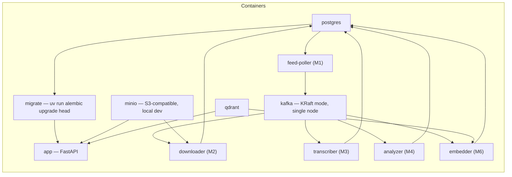

Each pipeline module's consumer is its own container/process (same app image, different command), so `docker-compose up --scale transcriber=3` scales module 3 independently if STT turns out to be the bottleneck. `kafka` runs single-node KRaft mode (no separate Zookeeper) for local dev; `migrate` still runs once before `app` starts. In production, `MINIO` is swapped for real S3 via env var.

## 12. Non-Functional Requirements (MVP scope)

**Reliability**: every pipeline stage (modules 1–4, 6) retries with bounded attempts via the shared backbone (§2) before landing in a `*_failed` status and a `pipeline.dlq` message, rather than retrying forever; failed episodes are visible and manually retriable, never silently dropped. Kafka's at-least-once delivery means every consumer must be idempotent on redelivery — true here because every write is either an overwrite-by-id (S3 key, transcript row, intelligence row) or an upsert-by-id (Qdrant points), never an append.

**Observability**: structured log fields per consumer — `podcast_id`, `episode_id`, `stage`/module, `duration_ms`, and (for STT/Claude/Voyage calls) an estimated cost — plus **consumer lag per topic** (which module is falling behind) are enough at MVP scale to answer "what's stuck," "what did this cost," and "which module is the bottleneck," without standing up a full metrics stack.

**Cost management**: only newly-discovered episodes enter the pipeline (module 1 dedup); module 4 is one Claude call per episode (Haiku for the cheap chunk-map step, Sonnet only for final synthesis); module 6 is two batched Voyage calls per episode (not one per chunk); reprocessing/re-embedding are explicit and version-gated, never automatic. Query-time embedding (module 6) is one cheap Voyage call per search request, not per episode.

## 13. Key Design Decisions & Trade-offs

| Module | Decision | Chosen | Alternative considered | Why |
|---|---|---|---|---|
| 1 | Podcast discovery | Curated feed list (admin adds URL) | Auto-crawl podcast directories | Avoids building a directory-crawler + duplicate-podcast-matching problem before the core pipeline is proven |
| 2 | Audio delivery | Signed URL straight to object storage | Proxy audio bytes through the app | Keeps the app server off the hot path for large file transfer |
| 3 | Speaker diarization | Not in MVP | Enable if STT provider supports it | Adds provider-dependent complexity with no MVP consumer (search/filter by speaker is Phase 2) |
| 3 | Transcript storage | Postgres (`full_text` + JSONB `segments`) | Dedicated document store (e.g. Mongo, S3+index) | MVP episode volume fits comfortably in Postgres; one fewer datastore; JSONB segments feed directly into module 6's chunking |
| 4 | LLM provider | Anthropic Claude API (Sonnet for final structured extraction, Haiku for cheap chunk-summarization) | OpenAI-compatible client (e.g. Mesh API, as used in SmartReco) | Explicit product choice to standardize on Claude; tool-use with a forced JSON schema gives the structured-output guarantee module 4 needs |
| 4 | Topic taxonomy | Freeform LLM topics, normalized via slug get-or-create | Fixed/curated taxonomy | Ships immediately; a fixed taxonomy needs curation effort and risks missing real content |
| 4 | Calls per episode | One Claude call (summary+topics+keywords together, Haiku for chunk-map if needed) | Separate call per field/chunk | Same total signal, a fraction of the cost and latency |
| 4 | Reprocessing | Explicit, version-gated (`model`/`prompt_version` columns) | Automatic reprocessing on every prompt change | Bounds cost — a prompt change doesn't silently re-bill every episode ever ingested |
| 5 | Search engine | Postgres full-text (`tsvector` + GIN) | OpenSearch/Elasticsearch | No extra infra to run/operate; a module 5 result is already useful standalone |
| 6 | Embeddings provider | Voyage AI | OpenAI embeddings, self-hosted (e.g. BGE/sentence-transformers) | Claude has no embeddings endpoint; Voyage is Anthropic's recommended pairing, keeps the text-understanding stack on one vendor relationship. Self-hosted remains a fallback if Voyage cost/availability becomes a problem |
| 6 | Vector DB | Qdrant | Chroma / Pinecone / FAISS / pgvector | Clean upsert/delete-by-id API matches module 6's job exactly; strong metadata filtering; self-hosted, no external cost/dependency |
| 6 | Embedding granularity | Two collections: episode-level (ranking/filtering) and segment-level (relevant-timestamp) | Episode-level only | Episode-only search can say *that* an episode matches but not *where* — segment vectors deliver the "click result → jump to the exact discussion" differentiator, without needing full LLM topic segmentation |
| 5+6 | Search architecture | Hybrid: module 5 (keyword) + module 6 (vector), merged via reciprocal rank fusion | Vector-only, or keyword-only | Neither alone covers both "exact term I know is in there" and "concept I can't phrase exactly"; RRF combines both without classifying query intent first |
| Backbone | Pipeline coordination | Choreography — each module consumes/produces topics, no component knows the whole flow | Central orchestrator (Temporal/Cadence/Step Functions/Airflow-style workflow) | The pipeline is strictly linear with no conditional branching, which is exactly where choreography's loose coupling and independent-scaling wins outweigh an orchestrator's main payoff (managing branchy flows, one execution-history view). Costs accepted: retry/backoff/DLQ logic is duplicated per consumer instead of defined once (mitigated below); no single "trace this episode" view — mitigated by keeping `episodes.status`/`attempts` (§9) as a persisted, queryable per-episode source of truth instead of reconstructing state from Kafka offsets; no automatic stuck-consumer detection (a crash mid-task without reaching `pipeline.dlq` needs a separate staleness sweep on `episodes.updated_at`, not a built-in activity timeout). Revisit if the flow gains real branching (e.g. per-language or per-tier routing) or "why is episode X stuck" becomes a frequent support question |
| Backbone | Async backbone | Kafka, one topic per module transition, consumer-group-per-module | Celery + Redis (task queue) | Per-episode ordering, independent module scaling, replay from a topic offset, room for future consumers off `episode.indexed`. Trade-off: materially more operational surface (broker, partitions, rebalancing, retry-topic plumbing) than a task queue for what is still a linear, moderate-volume pipeline — worth it because event-driven fan-out and replay are explicit product requirements |
| Backbone | Retry mechanism | Per-consumer backoff + re-produce to same topic, header-tracked attempts, DLQ on exhaustion | A dedicated delayed-retry topic per stage (`*.retry`) | Fewer topics to manage; bounded (max 3 attempts) so it doesn't risk blocking a consumer for long |
| Backbone | Enum-like columns | `VARCHAR + CHECK` | native Postgres `ENUM` | `status` is expected to grow states over time; native enums are painful to extend via migration |
| App | Playback resume | Client-side `localStorage` | Server-side per-user state | No user accounts in MVP — server-side state would require building auth just for this one feature |
| App | Admin auth | Static API key header | Full JWT/user/role system | Feed curation is low-frequency and low-blast-radius; a user system isn't otherwise needed until personalization (Phase 3) |

**Mitigating the duplicated retry logic**: rather than each of the five consumers hand-rolling its own backoff/DLQ handling, the backoff-sleep → header-increment → DLQ-on-exhaustion sequence (§2) should live in one shared library function that every consumer calls with its own topic names — duplicated in *invocation*, not in *implementation*. This keeps the choreography trade-off's main cost from compounding as more stages get added.
